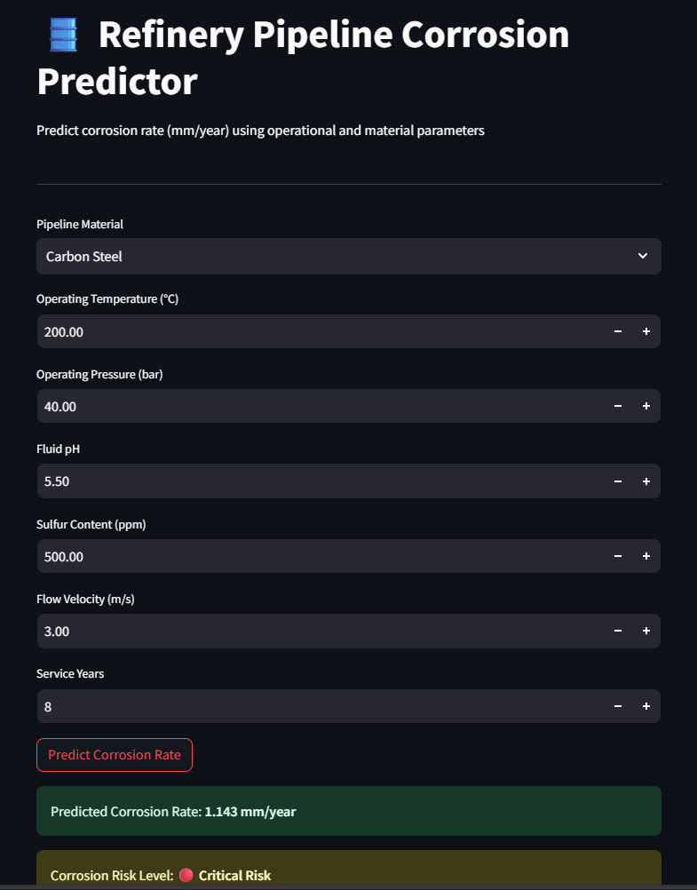

---

# 🛢️ Corrosion Rate Predictor for Industrial Pipelines



---

## 📌 Project Overview

Corrosion is one of the most critical challenges in industrial pipeline systems. Over time, pipelines operating under **high temperature, pressure, corrosive fluids, and varying flow conditions** experience material degradation, which can lead to leakage, unplanned shutdowns, safety hazards, and high maintenance costs.

This project presents an **end-to-end machine learning solution** that predicts the **corrosion rate (mm/year)** of pipelines using operational and material parameters.
The solution bridges **materials engineering knowledge** with **data analytics and machine learning**, enabling **predictive maintenance and risk-based decision-making**.

---

## 🎯 Why This Project?

### ❓ Problem Statement

Traditional corrosion monitoring methods are often:

* Reactive rather than predictive
* Time-consuming and inspection-heavy
* Dependent on periodic manual checks

These approaches may fail to identify **high-risk pipelines early**, leading to:

* Unexpected failures
* Increased operational downtime
* Safety and environmental risks

### ✅ Solution Provided

This project:

* Uses **historical and operational data** to predict corrosion rate
* Converts raw engineering data into **actionable risk insights**
* Provides a **user-friendly web interface** for real-time prediction

---

## 🧠 What This Project Solves

* Predicts corrosion rate instead of relying only on periodic inspections
* Helps identify **high-risk pipelines early**
* Supports **preventive maintenance planning**
* Demonstrates how **engineering + data science** can work together

---

## 🏗️ Project Architecture

```
User Input (Streamlit UI)
        ↓
Preprocessing Pipeline
(Scaling + Encoding)
        ↓
Trained ML Model
(Random Forest Regressor)
        ↓
Predicted Corrosion Rate
        ↓
Risk Classification
(Low / Medium / High)
```

---

## 📊 Dataset Description

The model is trained on a structured dataset containing realistic industrial parameters:

| Feature             | Description                |
| ------------------- | -------------------------- |
| material            | Pipeline material type     |
| temperature_c       | Operating temperature (°C) |
| pressure_bar        | Operating pressure (bar)   |
| ph                  | Fluid pH                   |
| sulfur_ppm          | Sulfur content in fluid    |
| flow_velocity_ms    | Flow velocity (m/s)        |
| service_years       | Years in service           |
| corrosion_rate_mmpy | Target variable (mm/year)  |

---

## 🧪 Methodology

### 1️⃣ Exploratory Data Analysis (EDA)

* Distribution analysis of corrosion rate
* Relationship between temperature, pH, sulfur, and corrosion
* Material-wise corrosion behavior

### 2️⃣ Data Preprocessing

* One-Hot Encoding for material types
* Feature scaling using StandardScaler
* Pipeline-based preprocessing for reproducibility

### 3️⃣ Model Development

Two models were trained:

* **Linear Regression** (baseline)
* **Random Forest Regressor** (final model)

📌 The Random Forest model was selected due to:

* Better performance on non-linear relationships
* Higher R² score and lower error metrics

### 4️⃣ Model Evaluation

* R² Score
* RMSE
* MAE

### 5️⃣ Deployment

* Trained pipeline exported as `.pkl`
* Integrated with a **Streamlit web application**

---

## 🖥️ Streamlit Web Application

The web app allows users to:

* Select pipeline material
* Enter operating conditions
* Instantly predict corrosion rate
* View corrosion risk level visually

### 🚀 Live App

👉 **[Launch Streamlit App](PASTE_YOUR_STREAMLIT_LINK_HERE)**

*(Replace the link above after deployment)*

---

## ⚠️ Corrosion Risk Classification

| Corrosion Rate (mm/year) | Risk Level |
| ------------------------ | ---------- |
| < 0.2                    | Low        |
| 0.2 – 0.5                | Medium     |
| > 0.5                    | High       |

This classification converts raw predictions into **engineering-friendly insights**.

---

## 🛠️ Tech Stack Used

* **Python**
* **Pandas, NumPy**
* **Scikit-learn**
* **Matplotlib, Seaborn**
* **Streamlit**
* **Pickle (Model Serialization)**

---

## 📁 Repository Structure

```
├── App_Dashboard.png
├── Corrosion_Rate_Predictor.ipynb
├── app.py
├── corrosion_model.pkl
├── requirements.txt
├── LICENSE
└── README.md
```

---

## ▶️ How to Run the Project Locally

### 1️⃣ Clone the Repository

```bash
git clone <your-repo-link>
cd <repo-folder>
```

### 2️⃣ Install Dependencies

```bash
pip install -r requirements.txt
```

### 3️⃣ Run Streamlit App

```bash
streamlit run app.py
```

---

## 📌 Key Learnings from This Project

* Translating **materials science concepts into data features**
* Handling **non-linear relationships** using ensemble models
* Building **reproducible ML pipelines**
* Deploying ML models into real-world web applications
* Managing **model serialization and environment consistency**

---

## 🔮 Future Improvements

* Integration with real-time sensor data
* Explainable AI (SHAP) for corrosion drivers
* Automated inspection scheduling logic
* Cloud-based deployment

---

## 👤 Author

**Sudipta Biswas**
Metallurgical & Materials Engineering | Data Analytics
Passionate about applying data-driven approaches to engineering problems

---

